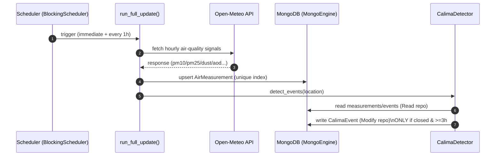
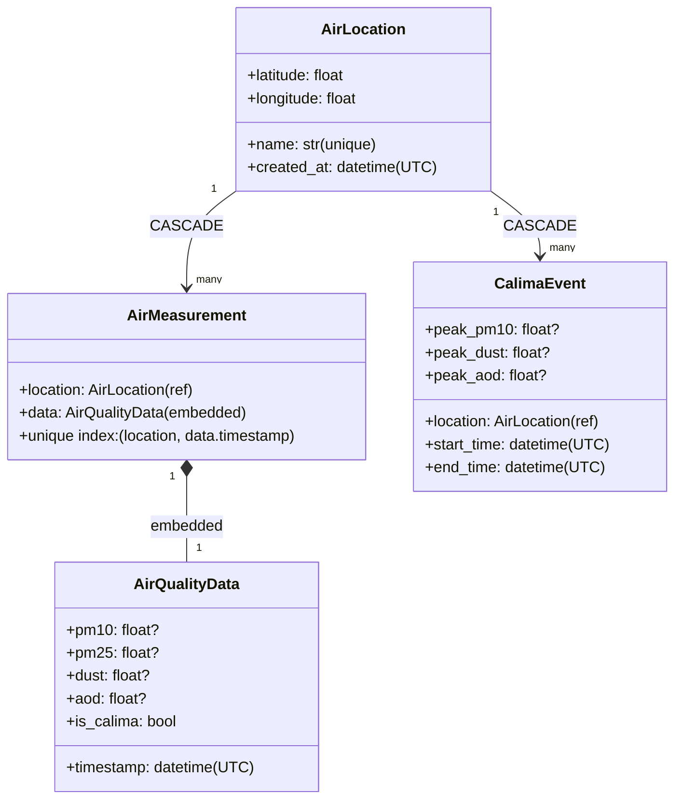

# 🌫️ Calima Dashboard — Canary Islands Air Quality & Dust Monitoring

<!-- ===================== -->
<!-- Badges (edit placeholders) -->
<!-- Replace <USER> and <REPO> with your GitHub username/repo name. -->
<!-- If you use a different workflow file name than ci.yml, update the URL. -->
<!-- ===================== -->


[](https://github.com/<USER>/<REPO>/actions/workflows/ci.yml)
[](https://codecov.io/gh/<USER>/<REPO>)

Interactive platform for monitoring **Calima (Saharan dust events)** and air-quality signals in the **Canary Islands**, based on **hourly environmental data from Open-Meteo**, stored in **MongoDB** and processed with a **CQRS architecture** and an idempotent **CalimaDetector**.

The system collects air-quality data, stores it in MongoDB, detects Calima events, and presents the results through an **interactive Streamlit dashboard**.

---

## 🔗 Demo

- **Live Demo:** `https://YOUR_DEMO_LINK_HERE`

---

## 🚀 Features

- 🌍 Monitoring of air-quality conditions in the Canary Islands
- 🌫️ Automatic detection of **Calima (Saharan dust events)**
- ⏱️ **Hourly automatic updates** via scheduler (runs once immediately + every hour)
- 🗄️ MongoDB database using **MongoEngine ODM**
- 🧠 Event detection logic implemented with **CQRS architecture**
- 📊 Interactive **Streamlit dashboard** (maps, charts, legend, severity levels)
- 🧪 Automated tests with **pytest** and **high coverage** (project includes coverage artifacts)

---

## 🧭 System Architecture (Mermaid)

### High-level flow

```mermaid
flowchart LR
  A[Open-Meteo API<br/>hourly signals] -->|fetch| B[UpdateService<br/>src/service/update_service.py]
  B -->|upsert hourly measurements| C[(MongoDB)]
  C --> D[ReadAirRepository<br/>src/repository/repository.py]
  D --> E[CalimaDetector<br/>src/repository/calima_detector.py]
  E -->|persist closed events (>= 3h)| F[ModifyAirRepository<br/>src/repository/repository.py]
  F --> C
  C --> G[Streamlit Dashboard<br/>streamlit_main.py]
```

### Hourly scheduler (what runs in production)



---

## 🧱 Project Structure

```
.
├── docker-compose.yml
├── Dockerfile
├── main.py
├── streamlit_main.py
├── requirements.txt
├── Pipfile
├── Pipfile.lock
├── pytest.ini
├── .coveragerc
│
├── demo/
│   ├── calima_export.json
│   ├── export_mongo_to_json.py
│   └── streamlit_demo_json.py
│
├── src/
│   ├── api/
│   │   └── open_meteo_api.py
│   │
│   ├── dashboard/
│   │   ├── app.py
│   │   ├── data/
│   │   │   └── db.py
│   │   ├── domain/
│   │   │   └── severity.py
│   │   └── ui/
│   │       ├── charts.py
│   │       ├── legend.py
│   │       ├── map.py
│   │       └── theme.py
│   │
│   ├── repository/
│   │   ├── calima_detector.py
│   │   ├── db_config.py
│   │   ├── model.py
│   │   └── repository.py
│   │
│   └── service/
│       └── update_service.py
│
└── tests/
    ├── test_calima_detector.py
    ├── test_open_meteo_api.py
    ├── test_repository.py
    └── test_update_service.py
```

---

## 🗄️ Database Model (MongoEngine)

The database is designed around 4 core entities:

- **AirLocation** *(Document)*  
  Represents a measurement location with fixed geographic coordinates.
  Deleting a location cascades into deleting all related `AirMeasurement` and `CalimaEvent` (CASCADE).

- **AirQualityData** *(EmbeddedDocument)*  
  Embedded hourly measurement:
  `timestamp`, `pm10`, `pm25`, `dust`, `aod`, `is_calima`.

- **AirMeasurement** *(Document)*  
  Stores a single hourly measurement associated with a location and embedded `AirQualityData`.

  **Key design feature:** unique compound index preventing duplicates:
  ```text
  (location, data.timestamp)
  ```

- **CalimaEvent** *(Document)*  
  Detected Saharan dust episode stored only if it lasts **≥ 3 hours** and is **closed**.

### Model relationships (Mermaid)



---

## 🧠 Calima Detection (CQRS + idempotent detector)

### CQRS
Detection uses two repositories:
- `ReadAirRepository` — reads measurements + existing events
- `ModifyAirRepository` — persists newly detected events

This separation improves clarity and testability (read path vs write path).

### Hour-level heuristic rules

An hour is classified as **calima** if any condition matches:

- `dust > 150`  
**OR**
- `pm10 > 50 AND aod > 0.5`  
**OR**
- `pm25 > 35 AND pm10 > 60`

### Event rules (multi-hour)

A **calima event** is:
- a continuous sequence of calima hours
- lasting **at least 3 hours** (≥ 3 hourly samples)
- **closed** (must end with a non-calima hour)

Important:
- **Open sequences at the end of available data are NOT persisted.**
- Detector is **idempotent**:
  - never overwrites existing events
  - scans only **after the end timestamp of the newest stored event** to avoid duplicates

---

## ⏱️ Automatic Hourly Updates

The scheduler in `main.py`:
- triggers once immediately on start
- then runs every hour

Update flow:
1. Fetch hourly data from **Open-Meteo API**
2. Upsert new measurements (unique index prevents duplicates)
3. Run detection & persist only valid closed events (≥ 3h)

---

## 🖥️ Dashboard (Streamlit)

The dashboard is implemented under `src/dashboard`:
- `ui/map.py` — map visualization of locations & conditions
- `ui/charts.py` — time-series charts (PM10/PM2.5/dust/AOD)
- `ui/legend.py` — legend & interpretation helpers
- `domain/severity.py` — domain logic for severity/calima intensity
- `data/db.py` — read layer for dashboard queries

Entry point:
- `streamlit_main.py`

---

## 🐳 Running the Project (Docker only)

### 1) Create `.env`

```env
MONGO_URI=mongodb://calima_mongo:27017
MONGO_DB_NAME=calima
API_KEY=YOUR_OPENMETEO_API_KEY_IF_USED
```

### 2) Start everything

```bash
docker-compose up --build
```

### 3) Open the dashboard

- http://localhost:8501

---

## 🧪 Tests & Coverage

Run tests:
```bash
pytest
```

Run with coverage:
```bash
pytest --cov=src --cov-report=term-missing --cov-report=html
```


## 🧠 Machine Learning (planned)

A dedicated **Machine Learning** section will be added in future versions, focused on:
- improved calima classification beyond heuristics
- anomaly detection
- time-series forecasting
- evaluation & explainability

---

## ⚙️ Tech Stack

- Python
- MongoDB 7
- MongoEngine
- Streamlit
- Docker + docker-compose
- pytest + coverage
- Open-Meteo API
- CQRS architecture

---

## 📄 License

MIT
